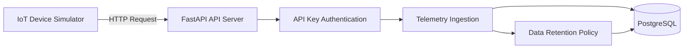

# IoT Telemetry Platform (Backend System Prototype)

## Overview

This project is a backend system prototype designed to simulate an IoT telemetry platform.
It demonstrates how devices can authenticate with an API, send telemetry data, and store it in a scalable backend architecture using FastAPI, PostgreSQL, and Docker.

The system was built to showcase backend engineering concepts, including:

* REST API design
* device authentication using API keys
* relational database modelling
* telemetry ingestion
* data retention policies
* structured logging
* containerised database deployment

Rather than focusing on a user interface, the project focuses on **system architecture and backend design**.

---

## Project Structure

```
app/
│
├── main.py           API endpoints
├── models.py         SQLAlchemy database models
├── schemas.py        Pydantic API schemas
├── database.py       Database configuration
└── security.py       Password hashing utilities

device_simulator.py   Simulated IoT device sending telemetry
docker-compose.yml    PostgreSQL container configuration
requirements.txt      Python dependencies
README.md             Project documentation
```

---

## Architecture

The system models a typical IoT data pipeline:

User
→ owns → Device
→ sends → Telemetry data
→ stored in → PostgreSQL database

Main components:

* **FastAPI** – API framework handling requests
* **PostgreSQL** – persistent telemetry storage
* **SQLAlchemy** – ORM for database interaction
* **Docker** – containerized database service

System Architecture:



### Data Flow

1. A user creates a device.
2. Each device receives a unique API key.
3. The device sends telemetry data to the API.
4. The API authenticates the device using a Bearer token.
5. Telemetry data is stored in the database.
6. Older telemetry records are automatically deleted when retention limits are reached.

---

## Database Schema

### Users

Stores registered users.

Fields:

* id
* username
* hashed_password

### Devices

Represents IoT devices owned by users.

Fields:
* id
* name
* api_key
* owner_id
* last_seen

Relationship:

* one user → many devices

### Telemetry Records

Stores device telemetry data.

Fields:

* id
* device_id
* metric_type
* value
* timestamp

Relationship:

* one device → many telemetry records

---

## Device Authentication

Devices authenticate using an API key.

Telemetry requests must include a Bearer token in the header:

Authorization: Bearer <device_api_key>

Requests without a valid API key are rejected.

Possible responses:

* 401 – malformed authorization header
* 403 – invalid API key
* 404 – device not found

---

## Telemetry Retention Policy

To prevent unlimited data growth, the system limits the number of stored telemetry records per device.

When the number of records exceeds the configured limit:

* the oldest records are automatically deleted
* only the newest telemetry is retained

This simulates a realistic IoT data retention strategy.

---

## API Endpoints

### Users

POST /users
Create a new user

GET /users
Retrieve all users

---

### Devices

POST /devices
Create a new device

GET /devices
List devices and their status

GET /devices/{device_id}/telemetry
Retrieve telemetry for a device

---

### Telemetry

POST /devices/{device_id}/telemetry

Submit telemetry data from a device.

Example request:

```
POST /devices/1/telemetry
Authorization: Bearer <device_api_key>
Content-Type: application/json
```

Body:

```json
{
  "metric_type": "temperature",
  "value": 22.5
}
```

---

## Running the Project

### Requirements

* Python
* Docker
* PostgreSQL (via Docker)

## Setup

1. Clone the repository
2. Create environment configuration

cp .env.example .env

3.1. Create a virtual environment (.venv)
3.2. Install dependencies

pip install -r requirements.txt

4. Start the database

docker compose up -d

5. Run the API

uvicorn app.main:app --reload

6. Open API documentation

In your web browser at: http://127.0.0.1:8000/docs

---

## Simulated Device

The project includes a device simulator that mimics a real IoT device sending telemetry data.

The simulator periodically sends requests to the telemetry endpoint, allowing the system to be tested under continuous telemetry ingestion.

---

## Key Engineering Concepts Demonstrated

* API authentication with headers
* relational database modelling
* background telemetry ingestion
* controlled error handling
* realistic telemetry retention logic
* modular backend architecture

---

## Future Improvements

Possible next iterations:

* user authentication (JWT)
* telemetry aggregation and statistics endpoints
* background workers for telemetry cleanup
* dashboard visualization
* rate limiting for device requests

---

## Author

Michal Chojka

*Backend system prototype created as part of a software engineering learning project focused on backend architecture and system design.*
